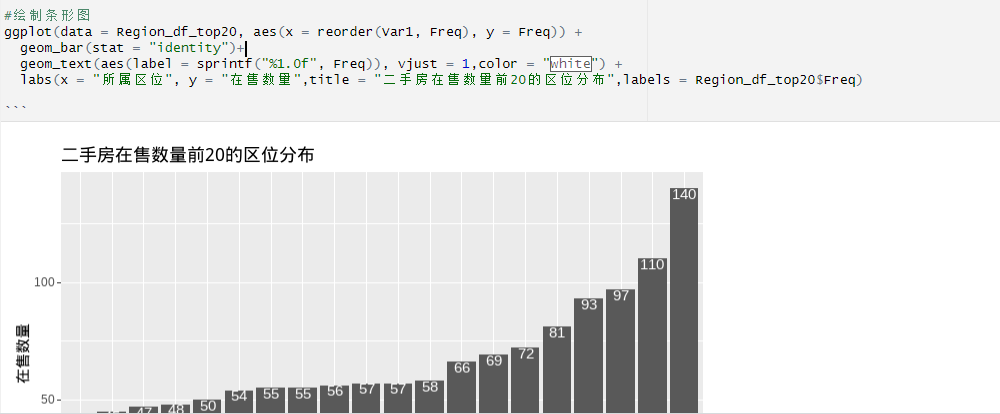

在ggplot2中，函数用于创建**柱状图**。它可以用于显示不同类别或分组的频数、计数或其他统计指标的比较。**数据间有间隙**
```R
geom_bar(
  mapping = NULL,
  data = NULL,
  stat = "count",
  position = "stack",
  ...,
  width = NULL,
  fill = NA,
  color = NA,
  alpha = NA,
  ...)
```

参数说明：
- `mapping`: 用于定义数据变量与图形属性的映射关系，例如x轴、y轴、颜色等。
- `data`: 数据框，包含要绘制的变量。
- `stat`: 统计变量的计算方法，常用的有"count"（计数）和"identity"（直接**使用原始值**，使用变量的实际值作为柱状图的高度。
stat = "identity"
- `position`: 柱状图的**摆放方式**，常用的有"stack"（默认，**堆叠**）、"dodge"（**并列**，对x轴进行分组）和"fill"（**填充**）。
- `width`: 柱状图的**宽度**，可以是一个常量值或一个表示宽度的表达式。
- `fill`: 柱状图的**填充颜色**。
- `color`: 柱状图的**边框颜色**。
- `alpha`: 柱状图的**透明度**。

以下是一个示例，展示如何使用`geom_bar()`函数创建柱状图：

```R
library(ggplot2)

# 创建一个数据框
data <- data.frame(
  category = c("A", "B", "C", "A", "B", "C"),
  value = c(10, 15, 8, 12, 9, 6)
)

# 创建柱状图
ggplot(data, aes(x = category, y = value)) +
  geom_bar(stat = "identity", fill = "blue", color = "black")
```

在这个示例中，我们创建了一个数据框`data`，其中包含了一个类别变量`category`和一个数值变量`value`。然后，使用`ggplot()`函数创建一个基本的绘图对象，并使用`geom_bar()`函数添加柱状图。在`aes()`函数中，我们将x轴映射到数据变量`category`，y轴映射到数据变量`value`。通过设置`stat`参数为"identity"，我们直接使用`value`变量的原始值。通过设置`fill`参数为"blue"和`color`参数为"black"，我们为柱状图指定了填充颜色和边框颜色。

这个示例将创建一个简单的柱状图，其中x轴表示类别，y轴表示数值。每个类别对应一个柱子，其高度表示对应的数值大小。

希望这个示例能帮助您理解`geom_bar()`函数的基本用法。如果您有任何其他问题，请随时提问。

### position参数
在ggplot2的`geom_bar()`函数中，`position`参数用于控制柱状图的摆放方式。该参数接受以下几个常用的取值：

- `"stack"`：默认值，表示将柱状图堆叠在一起，每个类别的柱状图叠加在前一个类别的柱状图上方。
- `"dodge"`：将不同类别的柱状图并列显示，柱状图之间不重叠。
- `"fill"`：将不同类别的柱状图堆叠在一起，但每个柱状图的高度归一化为1，形成堆叠的百分比图。
- `"identity"`：在x轴上根据数据的实际值进行对齐，不进行摆放调整。

以下是一个示例，展示了如何在`geom_bar()`中使用不同的`position`参数取值：

```R
library(ggplot2)

# 创建一个数据框
data <- data.frame(
  category = c("A", "B", "C"),
  value = c(10, 15, 8)
)

# 创建柱状图，并使用不同的position参数取值
ggplot(data, aes(x = category, y = value)) +
  geom_bar(position = "stack", fill = "blue", color = "black") +
  geom_bar(position = "dodge", fill = "red", color = "black") +
  geom_bar(position = "fill", fill = "green", color = "black") +
  geom_bar(position = "identity", fill = "orange", color = "black")
```

在这个示例中，我们创建了一个数据框`data`，其中包含了一个类别变量`category`和一个数值变量`value`。然后，使用`ggplot()`函数创建一个基本的绘图对象，并使用`geom_bar()`函数添加柱状图。在每个`geom_bar()`函数中，我们设置不同的`position`参数取值，并为每个柱状图指定了不同的填充颜色和边框颜色。

运行这段代码会生成一个包含了四个柱状图的图形。每个柱状图都使用相同的数据，但根据不同的`position`参数取值，柱状图的摆放方式和显示效果会有所不同。您可以通过观察图中柱状图的叠加、并列、百分比堆叠以及与x轴的对齐来更好地理解每个`position`参数取值的效果。

希望这个示例能够帮助您理解在`geom_bar()`中使用不同的`position`参数取值的含义和效果。如果您有任何其他问题，请随时提问。

### [reorder()](../base-content/reorder().md)
根据频数实现从大到小或从小到大的排布

###  coord_flip() 实现x、y轴互换
```text
coord_flip() 
```


### 调整柱间距
有时间研究下！

R可视化——ggplot2调整柱状图柱子宽度及间距 - 科研那点事儿的文章 - 知乎 https://zhuanlan.zhihu.com/p/548155437

### 在组上加文本
用到geom_text()函数
