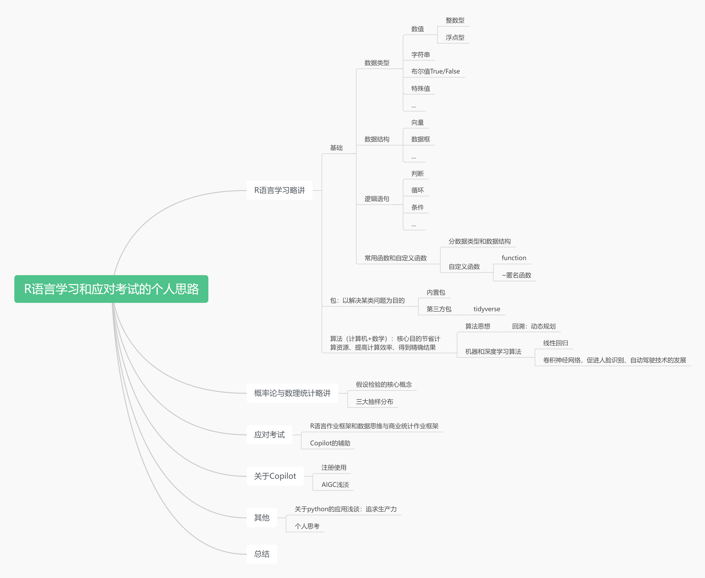
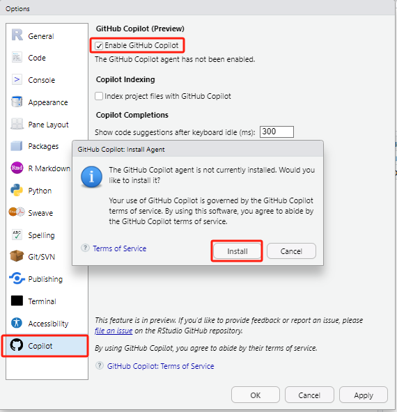

---



# 一、R语言学习
## 1，基础

### 1.1，数据类型
聚焦于**元素**。


**概念：**

```r
# 1，整形
没有小数部分的数据。

# 2，浮点型
带小数位的数据。跟整形的差别在于存储单元的分配上。

# 3，字符串
字母、汉字、数字、符号等。

# 4，布尔值，True（0），False（1）
逻辑运算（>,<,==,&,|,~），常见于条件判别。

# 5，特殊值
`NA`（not a valueble）,`NULL`,`NaN`,`Inf/-Inf`

```

**实践中的应用**：

```R
# 例：字符串
rename(viewers = `Viewers (millions)`, 
	   air_date = `Air Date`)
rename(viewers1 = viewers, 
	   air_date1 = air_date1)
# (1)作为变量直接用变量名表示，如果放在列表、向量中，需要加双引号，函数会解析为变量名；
# (2)带有特殊符号的变量，如带有空格需要加单引号或双引以表便编辑器识别为变量名。


# 例：布尔值
sum(...==...) #逻辑运算求和技巧
mutate(across(is.character, as.factor)) #类型转换
# 强烈建议以后遇到逻辑运算时大脑默认将结果转换为FALSE（0），TRUE（1），有助于理解和运用复杂的逻辑运算


# 例：特殊值
sum(...,na.rm=FALSE) # Na缺失值默认是不排除的，具体视情况而定

```


### 1.2，数据结构
聚焦于**元素间的关系**，为了提高存储和运算效率。

**概念：**

```r
# 1，向量
c(1, 2, 3) # 经常写的向量


# 2，数据框：简单理解为excel表格
data.frame(
name <- c("Alice", "Bob", "Charlie")
age <- c(25, 30, 35)
height <- c(165, 175, 185)
)
```
其他数据结构可以类比向量和数据框。

**实践中的应用**：

为什么唯独强调向量和数据框？数据分析中太常用了。你可能不知道向量和数据框，但你一定经常写这样的代码。

```r
data <- read_csv('C:/./.csv')

data$column1

ggplot(data) +
  geom_*(aes(x,y))
```

我们处理的最多的就是就是**结构化数据**(Excel表格)，这类数据**从excel导入**后一般都存在了数据框中，然后我们再进行处理。

### 1.3，逻辑语句
```r
# 1，判断语句
if(条件){

}

# 2，循环语句
for(条件){

}

# 3，条件语句
（>,<,==,&,|,~）
```

遇到条件语句转为布尔值，FALSE为0，True为1。

### 1.4，常用函数和自定义函数
（1）**常用函数**：

- 与数据类型相关，以博客内容为例


- 与数据结构相关，以博客内容为例

	[数据框](https://wngwai.github.io/R/00%20%E5%9F%BA%E7%A1%80%E7%9F%A5%E8%AF%86/)为例：主要的就是**数据框的创建、生成新的数据框、属性、索引、数据框的操作（增、删、改、查）**。


**实践中的应用**：
```R
# 修改数据结构中某列的数据类型
data %>%
  mutate(across(is.character, as.factor)) 
```


（2）**自定义函数**：
```r
# 1，function函数定义
function（）

# 2，~定义匿名函数
定义简单函数
```


**实践中的应用**：
```R
# 1，function
squre1 <- function(x){
  x^2
} # 默认返回最后一行计算结果
squre1 <- function(x){
  a <- x^2
  return a  
} # 通过return，指定返回内容

# 2，匿名函数
result <- map(my_list, squrel)

result <- map(my_list, ~.x^.x) # .x为占位符，逐元素计算
```

## 2，包packages
为了专门实现**某一类功能**，将各种相关函数打包放在了一起。就像我们为了避免写重复代码一样，应用function()定义常用功能函数。这种借鉴他人成果避免重复 **“造轮子”** 的 **“拿来主义”** 贯穿编程始终。

###  2.1，内置包
[内置函数举例](https://wngwai.github.io/R/01%20%E5%9F%BA%E7%A1%80%E5%87%BD%E6%95%B0/)


内置函数包往往都是常用的基础功能，但要实现复杂的功能了？

###   2.2，第三方包：
随着需求越来越多，内置包内已经无法满足，于是**非官方的人员**编辑了各种各样的函数包，以满足自身需要。
<br><br>

有些包非常好用，比如R中著名的**tidyverse**。

tidyverse是一个R语言中的**数据科学和数据处理工具集合**，由一系列互相依赖的第三方包组成，包括**dplyr、ggplot2、tidyr、readr**等等。tidyverse的目标是提供一种一致且直观的数据处理方法，使得数据科学家和分析师能够更轻松地进行数据清洗、转换、可视化和建模等操作。
<br><br>

我们每次**install.packages()** 都是从网上下载第三方包到本地软件中，因此下载一次后就不用重复下载，这也是Rstudio中写install.packages()报错的原因之一。

使用时**library()** 告诉系统我们要调单这个包里的函数了，让它提前准备好，文件关闭后存在系统的包就又被“放回去了”。这就是为什么每个文件开头都要“配置环境”，先运行library()才能使用第三方包内的函数。

## 3，算法
（计算机+数学）：核心目的节省计算资源、提高计算效率、得到精确结果等。
### 3.1，算法思想
回溯：动态规划中的应用。


### 3.2，机器、深度学习算法
**（1）线性回归**


>$$\frac1m\sum_{i=1}^m(y_i-\hat{y}_i)^2$$

核心目的：寻找一条直线方程，拟合坐标点，使得均方差损失函数最小。

这里面Loss funtion就涉及到**数学原理**的应用。为什么不用**绝对值误差**？因为用均方差可以得到一条光滑的曲线，进而微分，在寻找最优解时实现高效的运算。

（不要求掌握）关于最优解的具体计算，涉及到梯度下降算法（SDG），其中会涉及到**回溯**。

**（2）AlexNet卷积神经网络**

卷积神经网络(Convolutional Neural Networks, CNNs)算法在很大程度上推动了图像识别领域，特别是人脸识别技术的飞速发展。CNNs通过模仿人类视觉系统的处理方式，能够有效地提取和识别图像中的特征，使得它们在图像识别任务中取得了优异的性能。

（AlaxNet网络）


>**AlexNet (2012)**: 由Alex Krizhevsky等人开发的AlexNet在ILSVRC 2012中取得了压倒性的胜利，这标志着`深度学习在图像识别任务中的主导地位正式确立`。

<br>

**图像识别技术的快速发展大概源于**：

1，硬件的发展：以GPU为代表的硬件性能的提升；

2，数据积累：深度数据化，且积累了不少数据；

3，算法改进：更高效的算法。

图像识别技术的发展促在面部识别、商品识别（电商网购）、自动驾驶（特斯拉、华为）的技术发展和应用。

（28号的小米汽车技术发布会）


这也就是我们后期会深入涉及到各种算法的原因，因为**算法**才是前沿发展的精华所在，也是**效益**的代名词！
<br><br>


想要了解更多，关注学委分享的资料：

[学委的推荐的机器学习算法分类](https://mp.weixin.qq.com/s/g90puUxYe_B9_W-Cd5p04w)

# 二、概率论与数理统计
波波同学分享不少内容，在这里强烈推荐其中的概率论与数理统计、线性代数视频教程。

<https://wngwai.github.io/other/Link/>


高数、线代、概率论与数理统计是机器学习、深度学习的基础知识，可以**就着需要和空闲时间**查漏补缺。


**之后的课程**：都会涉及到相关知识。

| 学期 | 专业课程 |
| ---- | ---- |
| 研一下学期 | 《探索性数据分析与数据可视化》<br>《应用回归分析》 |
| 研二上学期 | 《机器学习与预测》<br>《实验设计与因果推断》 |

<br>

概率论与数理统计的内容非常多，我也有很多没有搞明白。这里只是简要介绍下我认为当前非常需要弄明白的核心概念。

### 1，假设检验的核心概念

以**考试成绩**为案例，假设某校的成绩满足正态分布，有学生1万人：

（1）总体分布

1万名学生的成绩分布情况。


（2）样本均值分布

样本容量为100的**样本分布**情况：


随机抽取10000个样本，每个样本容量为100，将样本均值作为数据绘制的直方图就是**样本均值分布**：


根据**中线极限定理**，样本均值足够多下，**样本均值分布**呈现**正态分布**，*样本均值分布的均值* 与总体均值μ相等。


**接收域、拒绝域、置信区间**都是在样本均值分布上看的。

假设检验的核心思路就是**小概率反证法**，从总体中抽取一个样本，样本的均值x_bar只有非常小的概率落在了样本均值分布的两侧，这两侧所代表的抽样事件被称为**极端情况**。

类似我连饮料的再来一瓶都没有中过，却中了彩票，要么我运气爆棚，要么我买了张假彩票（样本不来源总体），无论哪种情况，**极端事件发生了，我们都认为这个样本不属于总体**，这个样本中的数据可能来源于另一个学校，而我就是买到了一张假彩票。

但**会不会恰恰出现了极端情况**，这个样本就是来源原总体？如同我买到了一真的中奖彩票了？会的，所以有α的的概率犯去真的错误，也就是我有5%（α=5%）的概率错过成为富一代的机会。


（3）t分布

其实到了上面那步我们就该结束了，例如再次抽样，样本均值出现在两端，我们就可以说这个样本中的成绩一样不是我们学校的。这跟我们的**生活经验是相符合**，我们根据小孩身高估计小孩年龄、根据工龄估计输入等，身高1.7m你会排除小孩的范畴，工资2500你不会认为工龄很长。

但**数学家没有止步于此**，数学家想如果我不知道总体是什么分布，我该如果判这个样本是否代表极端情况发生？例如，我们不知道学校总体成绩μ，只有一个样本，只知道总体成绩的均值。

通过将样本均值**减去μ值（归一化）**，**除以标准误（去除单位影响）**，将上面的**样本均值分布**中的数据转换过来，就得到**t分布**。然后数学家通过抽取不同事物的样本，计算t值，发现t分布存在共性，通过复杂的数学证明，证明了这种共性背后的科学性。同样的，中心极限定理，也是通过观察自然现象得到得结果。

$$t=\frac{\bar{x}-\mu}{\frac s{\sqrt{\mathrm{n}}}}$$


**t-value、p-value**都是从t分布上看的。
<br><br>

- t（学生）分布的由来：

Gosset在啤酒厂工作，啤酒花原料的品质也影响啤酒的口感，而确定啤酒花的质量又费时费力，我们当下会想到可以抽样检测，但当时是没有理论依据的，Gosset经过实验，得到了我们上面所说的**样本均值分布**的类似结果，可以判断极端差的情况。


但Gosset**没有止步于此**，他之后去了伦敦大学进修，通过一年的实验研究，发表了下面这篇论文（1908年），也就是我们现在称呼的**t分布**。啤酒厂为维持巨大的效益，避免竞争对手猜到t分布可以用到原料检测中，老板不想让Gosset署名发表，所以最后**署名STUDENT**。


这或许就是数学的魅力，数学家通过有限的认知揭示了普遍的规律，因为是最本质的规律，所以数学能在各个学科上都得到应用，如**材料的安全系数、产品质检、投资风险管控**等。

### 2，三大抽样分布

t分布，t值；卡方分布，卡方值；F分布，F值等其他内容详见后面分享到群的**思维导图**。

# 三、应对考试

### 1，R语言、数据思维与商业统计作业框架

作业是最好的考题，关于数据分析的项目文档。

### 2，Copilot的辅助
借助GPT和Copilot。

**演示**：



---
休息时间！

2018年发布的[底特律：变人](https://www.bilibili.com/video/BV1JP4y1A7TG)

---

# 四、关于Copilot
## 1，Copilot的注册使用

- 获取的方式：
	
	[Copilot远程授权](https://shop.githubedu.com/buy/28)（我个人使用的。之前28元，现在99块，团购15份以上有8折优惠）；
	
	闲鱼上找找（推荐，我自己买的是28块/年）；

	Github上有免费的一个月试用，但需要绑定国外的银行卡；

	学生验证，有学生邮箱最为方便，没有上传学生卡好像也行，上知乎搜搜。

- [Rstudio的Copilot讲解](https://www.bilibili.com/video/BV1Vc411R767/)。

## 2，AIGC浅谈

上周二（12月26号）施耐德企业的参访，看去的同学的感想。


### 2.1，什么是**生成式AI**？
>AIGC（AI Generated Content）：指利用人工智能技术自动生成内容，它可以帮助我们写作、做图、做视频等等，而**Copilot只是AIGC的一种应用**。

**《艾瑞咨询-2023年中国AIGC产业全景报告》**（侵删）：

[艾瑞发布《AIGC系列报告--中国AIGC产业全景报告》](attachments/艾瑞发布《AIGC系列报告--中国AIGC产业全景报告》.pdf)

**产业图谱**：


### 2.2，应用举例
- **以AIGC生产图片为例**：[文心一格](https://yige.baidu.com/)

	对这种纯文字的描述大家可能没有具体的感受，我们一起来做个试验：
	
	时间地点？

	人物？
	
	事件？

（结果在后面揭示。）

- [英语学习Call Annie](https://callannie.ai/call)

- [盒马设计案例](https://mp.weixin.qq.com/s/jlNB_MrM67k1UUwphAl-ag)

（**看前面AIGC生成的图片！**）

### 2.3，小结
**抽象概括：**

科学技术是第一生产力，生产力决定生产关系，生产关系又反作用于生产力。人类社会发展的第一规律：生产力与生产关系的矛盾运动规律。

**形象概括：** 

从Office办公软件替代线下表格、CAD画图软件替代图纸绘图，数据模型替代手工计量、网购替换线下商场都是技术进步带来的生产关系的转变，而生产关系是社会关系中最基本的关系，必然带来**产业结构的调整、行业格局的改变、公司战略的调整、人事部门的变动和人员的升降**。
<br><br>

老师谈到**丝宝集团的数字化建设**不就是到了不得不进行重大改变的时候了吗？变寓意着风险，可变才有机会。

OpenAI、Copilot、Call Annie等AIGC工具能应用到如此广的领域，用户又如此的容易上手。这也让我更加坚信这次技术变革将深刻影响现有的社会关系，也深刻地影响着每一位普通人。

# 五、其他
## 1，关于python的应用浅谈：追求生产力

如果Copilot没有出现，多数人其实没必要学习Python，但Copilot工具的出现，让我觉得只需要明白基础的原理，普通人就能用Python写出解决工作、生活中**重复问题**和用于**辅助决策**的代码。
### 1.1，python（蟒蛇）
（1）简略

python语言跟R语言都是一种**编程语言**，R语言主要针对**统计分析**，而python语言的应用范围非常广阔。


（2）推荐理由：**适合交叉应用的个性化工具**

R语言在生活中发挥的作用太浅了，我们很难应用到实际中，但python不同，它跟工作、生活非常贴近！

从当前阶段上看，python具有易上手、功能全（前、后端）、第三方库多（数据分析、投资分析、机器学习、深度学习等不同领域）等优点；

Python在TIOBE排行榜中近几年都位居第一位。

[TIOBE排行榜](https://www.tiobe.com/tiobe-index/)


### 1.2，使用的思路

按照个人使用阶段介绍：

（1）Excel表格、数据透视表


（2）python的数据透视表应用：

[演示](https://cloud.tencent.com/developer/article/1664630)

我们工作会接触大量重复整理信息工作，而这些工作其实都可以进行梳理简化，交给程序完成。我个人当前接触了不少数据重复处理的任务，通过代码化节省了不少时间。

**人工+自动化的螺旋上升原则**：会多少用多少，以便形成正循环。

（3）数据可视化

（过）

（4）SQL

结构化数据，简单理解就是Excel中按表格存储的数据，知识SQL能存更多的数据，也方便操作。


[从SQL读取数](https://zhuanlan.zhihu.com/p/257850338)

（5）爬虫

SQL中的数据从何而来？定期爬取数据，存到SQL中。

**百度搜索**就是爬虫，APP中的**搜索框**都含有爬虫的原理。

不愿意错过惊天大瓜（八卦信息）、洋葱新闻、股价信息、优惠券、服装流行款式、微信红包等信息，都可以爬取汇总。

- 以二手房信息爬取为例。

- 在云服务器中部署网络爬虫。

（6）Web

个人的简易博客底层是markdown文件，类似我们编写的Rmd文件，通过后期转化，从而呈现了比较好看的效果，可以理解为**毛坯房和精装修(Web)**，而Web就是将上面的“毛坯”骨架变成方便使用的操作应用。

[链接](https://beingjay.com/2021/01/21/%E5%85%B3%E4%BA%8E%E5%89%8D%E7%AB%AF%E6%A1%86%E6%9E%B6React%E7%9A%84%E4%B8%AA%E4%BA%BA%E7%90%86%E8%A7%A3/)


**小结：**
爬虫(Python)-SQL-Python(数据清洗、处理、可视化、机器学习、深度学习)-Web(Python)。

AIGC辅助全程。

### 1.3，一定要结合个人业务

Python什么都有，但又什么都不“精”，大公司很少用它，但对于个人、小公司它却绰绰有余。

Python作为工具（生产力），使用工具是为了提高解决问题的效率！向工具要生产力，这是我个人学习python的原则。

Python和R的底层逻辑相近，但还是有些不少差异，虽然易上手，但想要熟练应用还是需要花费些时间和精力，我个人建议大家结合自身实际需求和学习进展综合考虑，采用**效益最大化原则**。

## 2，个人思考
### 2.1，个人的学习建议
按阶段来。

（1）**应对考试**：以作业题为准，常用函数的参数设置和问题处理，再借助GPT和Copilot；

（2）**应用机器学习、深度学习**：

到这里就不局限于常用R包了，涉及的函数五花八门。可用obsidian等笔记软件进行整理，对于零星函数，积少成多，随时间增删精简。

需要深入了解**函数参数**，了解参数所代表的**数学原理**，以[t.test](https://wngwai.github.io/R/base-content/t.test%28%29/?h=t.test)参数为例。


（3）**深度应用（工作）**：随着积累的函数增多，资料库可以作为字典。以实际中**常用项目汇总函数**，如上面分析的数据分析项目，或专门的爬虫项目等。

`积少成多进行及时归纳，增量学习，网状记忆！也能防止记乱`

（4）**成为个人工具（工具化）**：“借鉴”他人成果，避免重复“造轮子”！很多问题的解决都有现成的内容，如果没有现成的内容那么恭喜你，要么没有价值，要么价值独特。

### 2.2，（后面会删除）
### 1，动力不能只来源于压力：
在行动的过程压力逐步得到释放，而且会越来越小，达到临界点后反而会变为拖累。体现在考试前动力十足，考试后再也都不想动的循环中。


而兴趣完全相反，随着行动离目标越近，引力越大，动力越大。


所以，我的**第一条建议**是：如果你要长时间不得不面对一件事，具有压力的同时不要忘了培养兴趣，压力是启动时的推力，兴趣是过程中的吸力。

### 2，如何培养兴趣？

（1）寻找“接触点”

成年人对很多事物是并没有天然的兴趣，但兴趣是能培养的。而培养的关键就是找到适合个人的兴趣或者不太厌恶的“接触点”。

我以学习爬虫为例，你的兴趣点在那？抢红包、演唱会门票、好玩推荐、影片图书排行榜、自动签到、收集整理每日资料、进行投资决策等，总能找到关联点！我对于python的兴趣点是节省工作时间和提高个人效率，从而有时间做些别的事情。

又例如大家都好像对赚钱感兴趣，但其实未必喜欢钱本身，只是喜欢钱所带来的“自由”。

（2）关注个人能力和优势

其实很多兴趣的来源源于个人的特长和优势。大部分人对打游戏会比较感兴趣，但如果设上一个难度目标，很多人会感到非常痛苦。

### 3，处理压力
会有人说我对某事毫无兴趣，也找不到能吸引你的地方，但又不得不长时间面对，这时就要做好压力的处理。

（1）区分关注圈和影响圈

- 注意力在影响圈外：心有余而力不足，而很大一部分压力来源于此；
- 注意力在影响圈内：改变自己能改变的，才能渐渐扩大影响圈；
- 影响圈大于关注圈：影响力没能发挥出来。

>《高效能人士的七个习惯》


（2）拆解目标，促进行为

改变自己能改变的，为什么能渐渐扩大影响圈？可以看下下面的内容。

>《福格行为模型》，B（行为）=M（动机）+A（能力）+P（提示）
>
>当动机较大时。
>

>但动机较小，能力的影响。
>

>不断重复一种行为，会让它变得更容易做到。
>

拆解大的目标，直到满足自身能力，产生行动为止，最终重复行为得到动机和能力的提升，实现螺旋式上升！这是对“注意力在影响圈内，能渐渐扩大影响圈的”个人解读。以我个人跑步为例。

（3）适当的锻炼：培养耐心

锻炼本身就是忍耐痛苦和获得成就感的螺旋上升过程。即便是坐久了，站起来舒展筋骨都是不错的方式。

（4）间接性休息：

个人注意力难以长时间集中，如果开了小差、如果实在不想做，就先放下。有时自己长时间做一件事时，会很心烦，会忍不住拿起手机，但其实看手机内心也难以安定，其实这个时间穿插别的事情，或者起来走动走动，让自己放松放松会非常有效。

>《认知觉醒》，注意力曲线，注意力随时间递减


### 4，最后的建议

（1）肯定自己：

完成小任务后，请及时“肯定”自己。

及时：一旦做成某件事情，就要及时“肯定自己”；

肯定：不是只有物质奖励，行为暗示也行，比如捏紧拳头做出鼓舞的姿势。

更多的内容可以看《福格行为模型》，当个人建立更多的信心时，有些事就自然而然能够做下去！

（2）接受自己：

改变自己能够改变的，接受自己不能改变的！毕竟大家压力已经够大了。

# 结束语
感谢大家的观看。预祝大家元旦快乐！身体健康，恭喜发财！


